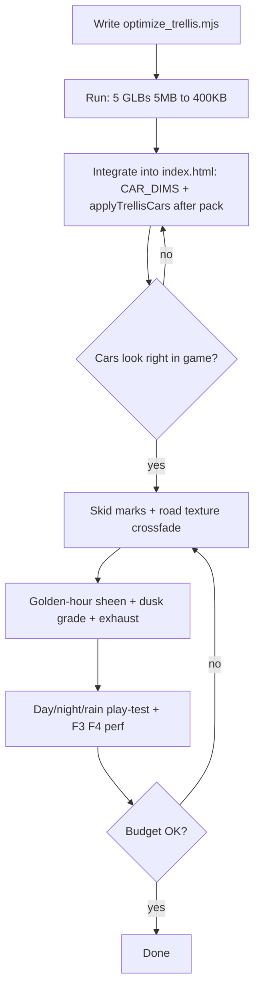

# Plan: GTA-Feel Visual Upgrade + Trellis Car Integration

Target file: `index.html` (sta2.html ignored per user). New script: `pipeline/optimize_trellis.mjs`.

## Context (verified in code)

- Vehicle loading priority: `applyCarPack()` (index.html:5290) loads `models/generic_passenger_car_pack.glb` and **replaces** the whole `VEHICLES` array. The fallback `applyVehicleMeshes()` (index.html:5566) only runs if the pack fails. So the 5 unused Trellis meshes (`meshes/car_trellis_1..5.glb`, ~5MB each, sourced from `cars/trellis2-*.glb`) must be **appended after the pack loads**, not just added to the fallback map.
- Single-shell AI meshes are already handled: `loadMesh()` (index.html:4987) normalizes dims via `CAR_DIMS`, `carveWheels()` (index.html:5020) cuts wheel masses out and specs clean cylinders, `splitCarMaterials()` splits paint/glass.
- Road: `roadMat` (index.html:645) has camber, vertex wear tracks, normal + roughness maps. Day/night texture swap at index.html:4387 is **binary** (`dayAmt01>.35`) — a visible pop at dawn/dusk.
- Sky/lighting: `updateSky()` (index.html:3123) runs a full cycle (starts at late afternoon, `nightLock=false`). PMREM env map from sky exists (index.html:3820), headlight beams + brake lamps exist.
- Optimization recipe already proven in `pipeline/optimize_models.sh`: prune → dedup → weld → simplify → quantize → texture cap. We port it to Node for Windows.

## Phase A — Trellis cars (the concrete ask)

### A1. `pipeline/optimize_trellis.mjs` (new Node script)
- Uses `@gltf-transform/core` + `@gltf-transform/extensions` + `@gltf-transform/functions` (need `npm i` in a scratch dir or project root).
- For each `cars/trellis2-*.glb` (5 files) → writes `meshes/car_trellis_N.glb` (N = 1..5, stable mapping):
  1. `prune()` — drop unused nodes/materials
  2. `dedup()` — merge duplicate vertices
  3. `weld()` — required before simplify
  4. `simplify({ratio: computed})` — target ~12,000 triangles per car (ratio = 12000/current, skip if already under)
  5. `quantize()` — KHR_mesh_quantization, three.js r160 reads natively, no decoder
  6. Texture pass: resize all textures to ≤512px, re-encode JPEG q85 (use `sharp` via gltf-transform's texture API; if sharp fails on this machine — known issue per optimize_models.sh comments — fall back to writing textures through `sharp` directly or keep PNG at 512)
- Prints before/after size + triangle count per file. Target: ≤ ~400KB each (from ~5MB).
- Also prints each mesh's bounding box so we can pin real `CAR_DIMS` values.

### A2. Run + verify
- `node pipeline/optimize_trellis.mjs`
- Confirm 5 outputs exist, sizes reasonable, triangle counts ≤ ~12k.
- Quick load sanity check (three.js GLTFLoader in the game itself will be the real test).

### A3. Integrate into `index.html`
1. Add 5 `CAR_DIMS` entries (`car_trellis_1..5`) with real l/w/h/r from A1's bounding boxes.
2. Add the 5 files to the fallback map in `applyVehicleMeshes()` so they also work pack-less.
3. New `applyTrellisCars()`:
   - Runs **after** `applyCarPack()` succeeds (chained in the existing async IIFE at index.html:5632).
   - Loads the 5 via `loadMesh()`, builds VEHICLES entries using the generated-shell structure (`geoBody`, `geoHi`, `generated:true`, `wheelSpec`, `dims`) **plus** clearcoat paint material (reuse the `packPaintFor()` recipe at index.html:5280 so they match the pack cars' gloss).
   - Names them distinctly (e.g. `trellis1..5`) so witness descriptions / car kinds stay coherent.
   - Calls `rebuildAllCars()` once so traffic + parked row pick them up.
4. Verify in-game: they spawn in traffic and parked row, wheels spin (carveWheels), headlights/brake lights attach, correct facing (the pack's majority-vote turn does not apply to these — check each one drives nose-first; `loadMesh` normalizes Z-forward already).

## Phase B — Road realism

### B1. Persistent skid marks
- A capped pool (e.g. 256 quads) of dark semi-transparent decals laid under the rear wheels when: handbrake sliding, or hard braking above ~40 km/h, or burnout (high throttle + low speed).
- Merged into one geometry, updated by writing into a pre-allocated buffer (same trick as `setParkedBoxShown` — no rebuilds). Marks fade over ~20s.
- Hook into existing `updateCarFx` where slip/handbrake state already lives.

### B2. Day/night road crossfade (kill the pop)
- Replace the binary `roadMat.map` swap (index.html:4387) with a smooth blend. Cheapest robust route: keep two materials? No — one material, and lerp `roadMat.color` + swap map only at the crossover moment while compensating color so the visual is continuous; OR use `onBeforeCompile` to mix two maps by a `uDayMix` uniform driven from `updateSky`. Preferred: the uniform mix (single draw call preserved, no pop at all). Same treatment for `kerbMat` (index.html:4404).

### B3. Golden-hour sheen
- In `updateSky()`: raise `roadMat.envMapIntensity` (base .22 → up to ~.8) and dip `roughness` (.94 → ~.80) proportional to `duskAmt * dayAmt` so low sun rakes long specular streaks down the asphalt — the signature GTA V sunset look. Values return to night/day baselines outside golden hour.

## Phase C — Day/night atmosphere polish

### C1. Warmer dusk grade
- In the grade pass (verify uniform names in code mode): push a warmer tint + slightly lifted blacks at dusk, cool the night slightly toward teal for that GTA V night feel. Driven by `duskAmt`/`nightAmt01` already computed in `updateSky`.

### C2. Exhaust smoke on hard acceleration
- `updateSmoke()` already exists — hook throttle > .8 + low speed to emit a small grey puff at the rear of the player's car. Cheap, adds life.

## Phase D — Verification

- Play-test both day and night (T / Shift+T), rain (R).
- F3 stats + F4 profile: confirm draw calls / triangles stay in budget (Trellis cars at 12k tris ≈ pack cars).
- Confirm no pop at dawn/dusk when road texture blends.
- Confirm total added download ≤ ~2MB for 5 cars.

## Workflow

## Risks / notes

- `sharp` (gltf-transform's texture backend) is known-broken on this machine per comments in `optimize_models.sh` — the Node script must have a fallback path (keep textures as resized PNG via a pure-JS resize, or accept 512px PNG which is still small).
- `simplify` needs welded geometry or it silently does nothing — weld first (same order as the bash script).
- The pack's majority-vote facing fix does not cover the Trellis shells; verify each drives nose-first and hand-flip any that don't (rotateY(PI) on geo + negate wheelSpec x/z).
- Keep everything inside what three.js r160 loads natively (quantization yes, Draco/meshopt no decoder — matches existing project policy).
